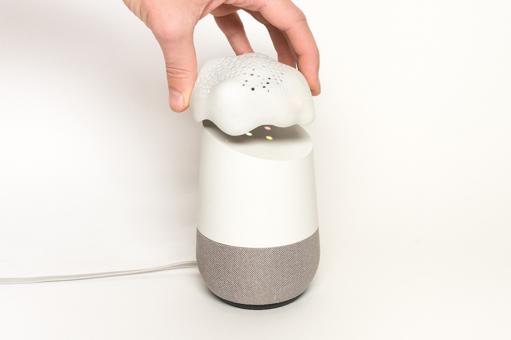
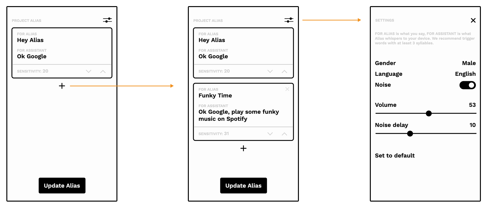

# Project Alias 2.0

<p float="left">
 
</p>

[](https://www.python.org/downloads/release/python-360/)


Project Alias is an open-source parasite to hack smart home devices. Train custom wake-up names and commands for your devices while disturbing their built-in microphone with noise. Introduce false labelling to their algorithm by changing gender or nationality. Read more about the project **[here](http://bjoernkarmann.dk/project_alias)**


This repository has been updated to 2.0. Find the old version under the branches

### 2.0 Features
- Multiple wake-up words
- Custom commands to be told to the assistant
- Change gender and language of Alias
- Adjust wake-up word sensitivity and delay
- New wake-up word detection powered by **[Pocketsphinx](https://cmusphinx.github.io/)**

### Build Guide
For the complete step-by-step guide and 3D files see our **[Instructables](https://www.instructables.com/id/Project-Alias)**


### Easy Setup 🔧
The Alias software can be flashed onto a micro SD card, for a fast and easy setup. Make sure the respeaker hat is attached to the Raspberry Pi.
1. **[Download](https://www.dropbox.com/s/k94bkqs4mkza0tj/alias2.0.img?dl=0)** the *alias2_0.img* file
2. Use **[Etcher](https://www.balena.io/etcher/)** to flash a micro SD card with the .img file
3. Insert the micro SD card into the Raspberry Pi 3A+
4. Power Alias up and wait for the yellow light to glow


*We recommend to use the Easy Setup but if you wish to install the project from scratch use the **Manual Install** instructions.*

### Start using Alias 🍄

1. Configure your Alias by connecting to its local wifi from your phone.
<br>ssid: **Project Alias**  psw: **cordyceps**.

2. Open a browser and enter the url: **alias.local** to interface with Alias.

3. From the interface you can now add new wake-up word / commands or edit existing ones. Save any changes by clicking the **Update Alias** button. We recommend to experiment with different words and sensitivity levels to find what works best for you.

4. To configure the settings, click the icon in the upper right corner. Here you can adjust and customize the noise, language, gender, volume and delay.
  *Tip: If you write the full command into alias you can create shortcuts and new functions. E.g. By calling 'Funky Time' you
  could have Alias whisper 'Ok Google, play some funky music on Spotify'.*





### Settings ⚙️

Setting | Description | Default
--- | --- | ---
Noise | This will turn on/off the looping noise| `ON`
Gender | Choose what gender the assistant should perceive when Alias whispers commands. By changing to the opposite gender you will able to introduce false labelling into the assistants algorithm. This confusion might lead to interesting interactions and answers. Note, this only changes the voice of Alias itself, and will therefore only have an effect with long commands. | `Male`
Language | Change the language Alias uses to speak to your assistant. This is to introduce another layer of noise that makes the system label you with a different nationality. To use this feature the command for the assistant has to be written in the same language. | `English`
Volume | Change the volume of the speakers. This needs to be loud enough for the noise to block the assistant, but low enough not to be audible. Settings can vary by acoustics and ambient inferences. | `39`
Noise Delay | This increase the delay after the wake-up word has been activated to restart the noise again. This is used as a noise free window, when asking the assistant a question. It should be set to match the appropriate time interval needed for the maximum length of a conversation. | `10s`
Sensitivity | This setting changes the sensitivity of the wake-up word detection. This setting is found on the front page for each command. The lower the number the less sensitive. | `20`


### Automatic Install (tested on 2020-02-13-raspbian-buster-lite)
If you wish to install it on your SO, you can use our automatic install script

1. Download the latest version of **[Raspbian Stretch](https://www.raspberrypi.org/downloads/raspbian/)** and flash your micro SD card with **[Etcher](https://etcher.io/)**


2. Copy the **ssh** and **wpa_supplicant.conf** files from the **[setup folder](setup/)** to the SD card (boot)


3. Edit the **wpa_supplicant.conf** in a text editor to match your wifi settings. Insert the card to the raspberry pi


4. In terminal ssh into the pi: ```sudo ssh pi@raspberrypi.local```<br>*Default password is 'raspberry'. To change password use the 'passwd' command*

5. Clone project_alias repo and execute install script:
```
sudo apt update -y && sudo apt upgrade -y && sudo apt install git -y
cd $HOME && git clone https://github.com/bjoernkarmann/project_alias.git
cd $HOME/project_alias/setup/ && ./install_script.sh
```

### Manual Install

If you wish to build this project manually, you can follow the guide below. We do recommend using the pre installed image linked in the Easy Setup.
1. Download the latest version of **[Raspbian Stretch](https://www.raspberrypi.org/downloads/raspbian/)** and flash your micro SD card with **[Etcher](https://etcher.io/)**


2. Copy the **ssh** and **wpa_supplicant.conf** files from the **[setup folder](setup/)** to the SD card (boot)


3. Edit the **wpa_supplicant.conf** in a text editor to match your wifi settings. Insert the card to the raspberry pi


4. In terminal ssh into the pi: ```sudo ssh pi@raspberrypi.local```<br>*Default password is 'raspberry'. To change password use the 'passwd' command*

#### RaspberryPi Setup
 How to prepare and setup a Raspberry Pi for this project:

1. Download the latest version of **[Raspbian Stretch](https://www.raspberrypi.org/downloads/raspbian/)** and flash your micro SD card with **[Etcher](https://etcher.io/)**


2. Copy the **ssh** and **wpa_supplicant.conf** files from the **[setup folder](setup/)** to the SD card (boot)


3. Edit the **wpa_supplicant.conf** in a text editor to match your wifi settings. Insert the card to the raspberry pi


4. In terminal ssh into the pi: ```sudo ssh pi@raspberrypi.local```<br>*Default password is 'raspberry'. To change password use the 'passwd' command*

5. Update the pi: ```sudo apt-get update && sudo apt-get upgrade```<br>

7. Reboot ```sudo reboot```


#### Installing Dependencies

*Note: Some dependencies might very for differen versions. This guide has last been tested and validated on Raspbian Stretch version 9.*

On the Rapsberry Pi: Enable interface SPI in raspi-config
```
raspi-config
```

Make sure you have python3 and git installed for the next steps:
```
sudo apt-get install python3-dev python3-pip git libatlas-base-dev
```

Clone and install the sound driver for the **[ReSpeaker](http://wiki.seeedstudio.com/ReSpeaker_2_Mics_Pi_HAT/)** hat:<br>
*– This is only required when using the ReSpeaker hat, this code will also work with other sound drivers.*

```
cd && git clone https://github.com/respeaker/seeed-voicecard.git
cd seeed-voicecard && sudo ./install.sh
```

Disable default sound card by following this **[guide](https://www.instructables.com/id/Disable-the-Built-in-Sound-Card-of-Raspberry-Pi/)**

Install **pocketsphinx** and dependencies
```
sudo pip3 install spidev
sudo apt-get install -y python python-dev python-pip build-essential swig git libpulse-dev
sudo apt-get install libasound2-dev
sudo apt-get install pulseaudio pulseaudio-utils libpulse-dev libpulse-java libpulse0
sudo pip3 install --upgrade pocketsphinx
```

Install **espeak**

```
sudo apt-get install espeak
```

Install **flask** server
```
sudo pip3 install flask flask_socketio
```

Install **pygame**
```
sudo apt-get install python3-pygame
```

To install a private network you can follow this **[guide](https://github.com/raspberrypi/documentation/pull/1097/files)**


Finally clone the **Alias** project:

```
git clone https://github.com/bjoernkarmann/project_alias.git
```


### Change assistant

If you are using **Google Home** or an **Amazon Alexa** the way you change the wake up word is simply by writing it in the responds field in the Alias web-app


### Contributors
Made by **[Bjørn Karmann](http://bjoernkarmann.dk)** and **[Tore Knudsen](http://www.toreknudsen.dk/)**


### License

This project is licensed under the GPL License - see the LICENSE.GPL file in the root folder
